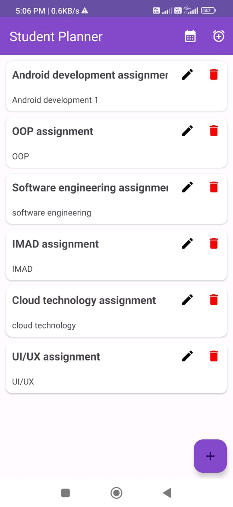

# Student_Planner
Student Planner android app helps students to organize their academic tasks and manage their schedules efficiently. The application provides features that assist students in tracking assignments, managing deadlines, and staying organized throughout their academic journey. Features of this app are as follows:
1. The application’s UI design is adaptive to different screen sizes
2. Implemented authentication mechanisms using Firebase authentication service
3. Students can create, edit, and delete tasks or assignments.
4. Students can attach images, screenshots and notes to tasks.
5. Students can schedule tasks and set deadlines on an in-app calendar.
6. Students can set alarms for specific events such as submission deadlines.

### Main Activity

